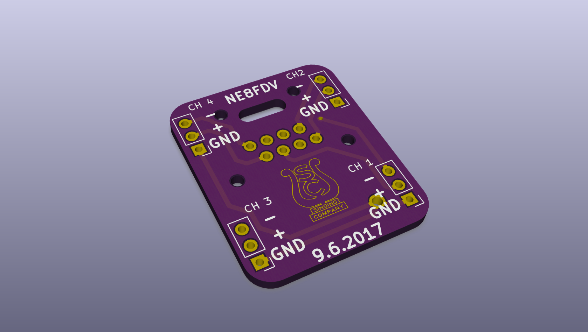
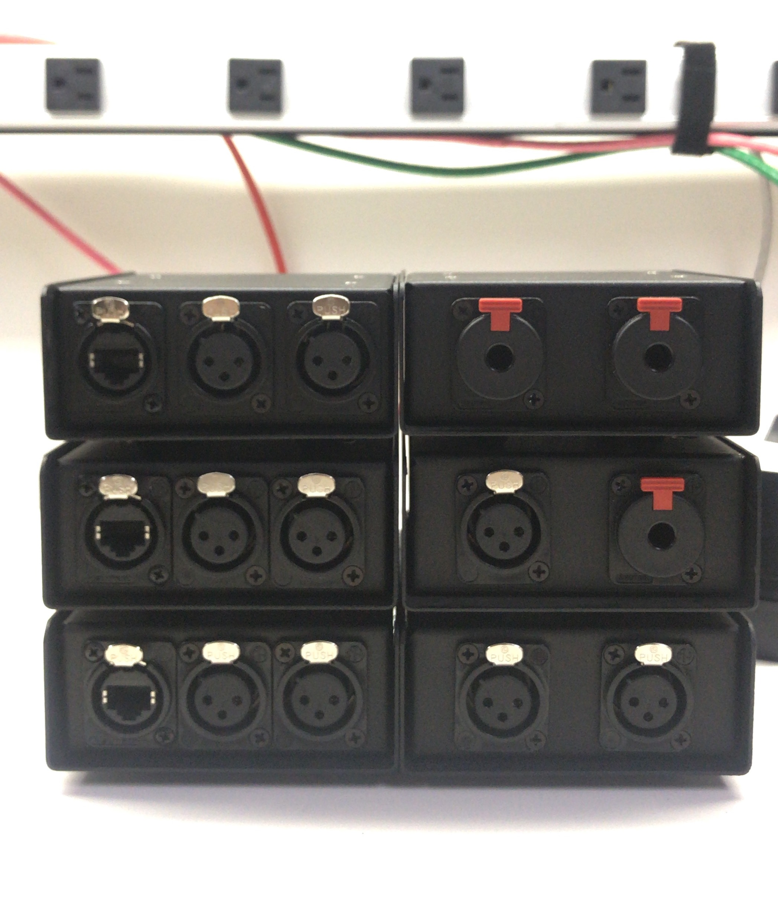
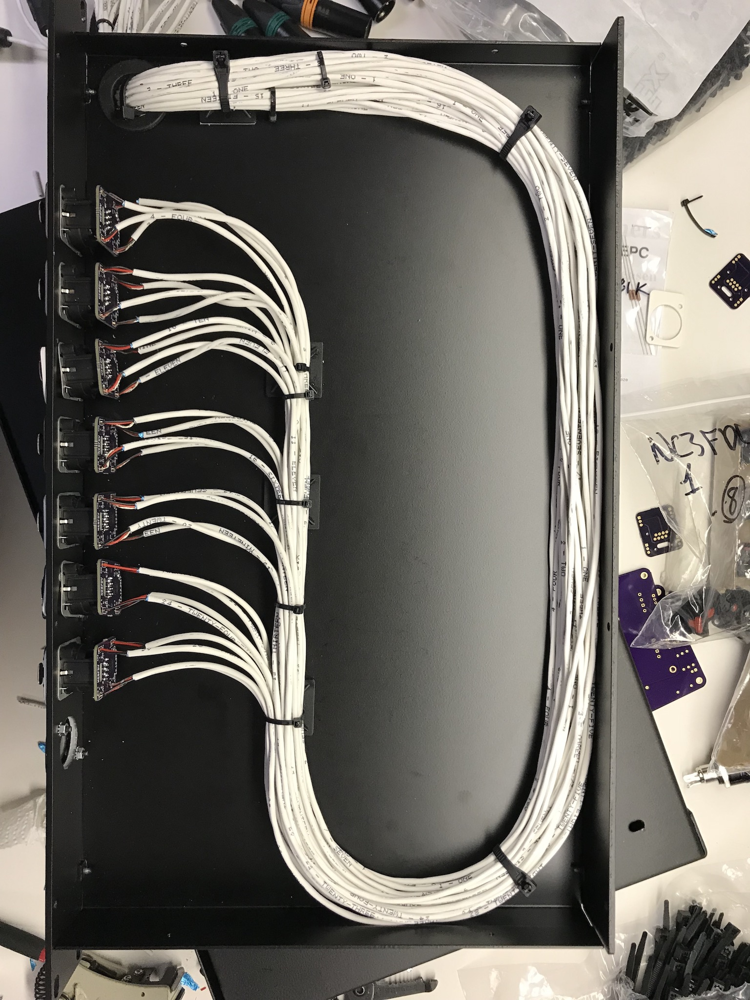
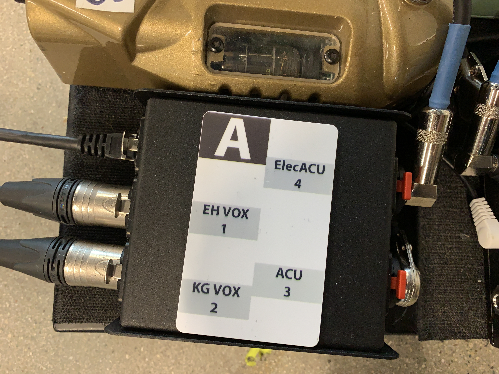
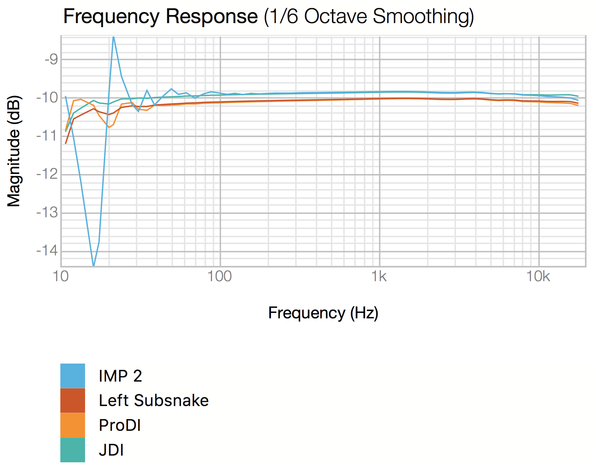

# CatPatch

This repository is a collection of reference images and PCB designs for a CAT5e/CAT6 based audio subsnake and DI system.

Labels can be printed on standard ID cards and can be attached with 3M Command Strip adhesive.

A build log for the DI and breakout cable can be found [here](https://imgur.com/a/OviKR)

## Pinouts
The system, as labeled, is pin-compatible with RAT and ETS audio twisted pair products.  The silkscreen and wiring can be adjusted to make it compatible with other standards.

| RJ45 Pin | T568B | RAT & ETS | Radial & Whirlwind |
|:--------:|:-----:|:---------:|:------------------:|
|    1     |  WO   |    2+     |         1+         |
|    2     |   O   |    2-     |         1-         |
|    3     |  WG   |    3+     |         2+         |
|    4     |   B   |    1-     |         3+         |
|    5     |  WB   |    1+     |         3-         |
|    6     |   G   |    3-     |         2-         |
|    7     |  WBr  |    4+     |         4+         |
|    8     |  Br   |    4-     |         4-         |
---
###### Sources
[RAT CAT Snake](http://www.ratsoundsales.com/mm5/pdf/etherCON_wiring_diagram.pdf) | [Radial Catapult](http://www.radialeng.com/wp-content/uploads/2018/05/Catapult-userguide.pdf) | [Whirlwind Catdusa](http://whirlwindusa.com/media/uploads/catdusa_manual.pdf)

## Cable
Shielded cable is needed when using phantom powered, Clear-Com, and DMX devices over twisted pair.  The shield is used for pin 1/ground for the connected devices. An EtherCON connector does not indicate that a cable is shielded.

Dynamic mics and passive DIs may work without the recommended shield.

## BOM
#### Breakout Panel

| Item                                       | Manufacturer | Quantity | Price Each |
|:-------------------------------------------|:-------------|:--------:|-----------:|
| [CH1/10 1U rackmount chassis][1]           | Redco        |    1     |     $66.95 |
| [NE8FDV-B Vertical EtherCON][2]            | Neutrik      |    7     |      $4.17 |
| [NC3MXX-BAG Male XLR][3]                   | Neutrik      |    28    |      $2.96 |
| [SBR Rubber Push-In Grommet 1-3/16" ID][4] | -            |    1     |  $11.80/10 |
| [Neutrik Black Screw for etherCon][5]      | Neutrik      |    14    |       $.21 |
| [Neutrik DBA-BL D blank][6]                | Neutrik      |    1     |       $.73 |
| [Flat Head Screws][7]                      | -            |    2     |   $6.49/50 |
| [Steel Locknut with Lock Washer][8]        | -            |    2     |  $8.72/100 |
| N8FDV breakout PCB                         | Custom       |    7     |          - |

#### DI Box
| Item                                                    | Manufacturer      | Quantity | Price Each |
|:--------------------------------------------------------|:------------------|:--------:|-----------:|
| [Steel Project Box Pre-Punched for 5 D Series XLRs][11] | Pro Speaker Parts |    1     |     $16.65 |
| [NE8FDV-B Vertical EtherCON][2]                         | Neutrik           |    1     |      $4.17 |
| [NC3FD-L-1-BAG Panel mount D XLR][12]                   | Neutirk           |    2     |      $3.22 |
| [NJ3FP6C-BAG Panel mount D TRS][13]                     | Neutrik           |    2     |      $5.76 |
| [JT-DB-EPC Transformer][14]                             | Jensen            |  1 - 2   |     $73.08 |
| __OR__                                                  |                   |          |            |
| [Transformer for PROAV2 and PRODI][15]                  | Radial            |  1 - 2   |     $36.00 |
| [Neutrik Black Screw for etherCon][5]                   | Neutrik           |    2     |       $.21 |
| [Flat Head Screws][7]                                   | -                 |    8     |   $6.49/50 |
| [Steel Locknut with Lock Washer][8]                     | -                 |    8     |  $8.72/100 |
| [Press-Fit Threaded Standoffs][16]                      | -                 |    4     |   $9.14/25 |
| [Button Head Hex Drive Screw][17]                       | -                 |    4     | $11.00/100 |
| N8FDV breakout PCB                                      | Custom            |    1     |          - |
| DI breakout PCB                                         | Custom            |    1     |          - |

[1]: https://www.redco.com/Redco-CH1-10-10-Deep-1U-Rackmount-Chassis.html
[2]: http://www.fullcompass.com/prod/516653-Neutrik-NE8FDV-B
[3]: https://www.redco.com/Neutrik-NC3MXX-BAG.html
[4]: https://www.mcmaster.com/#9600k119/=1cjo0vf
[5]: http://www.fullcompass.com/prod/199358-Neutrik-E-SCREW1-12B
[6]: http://www.neutrik.com/en/xlr/xlr-chassis-connectors-accessories/dba-bl
[7]: https://www.mcmaster.com/#91698a306/=1cjoepo
[8]: https://www.mcmaster.com/#93825a110/=1cjog5u

[11]: https://www.ebay.com/itm/Steel-Project-Box-4-1-2-x-3-3-4-x-1-5-8-Pre-Punched-for-5-D-Series-XLRs/281422391821?hash=item418614ea0d:g:rqUAAOSwxH1T-7Bo
[12]: https://www.redco.com/Neutrik-NC3FD-L-1-BAG.html
[13]: https://www.redco.com/Neutrik-NJ3FP6C-BAG.html
[14]: http://www.jensen-transformers.com/transformers/direct-box/
[15]: http://www.fullcompass.com/prod/279709-Radial-Engineering-R800-9033-00
[16]: https://www.mcmaster.com/#93090a210/=1cjopy9
[17]: https://www.mcmaster.com/#91255a106/=1cjoqt3

## Project Images

